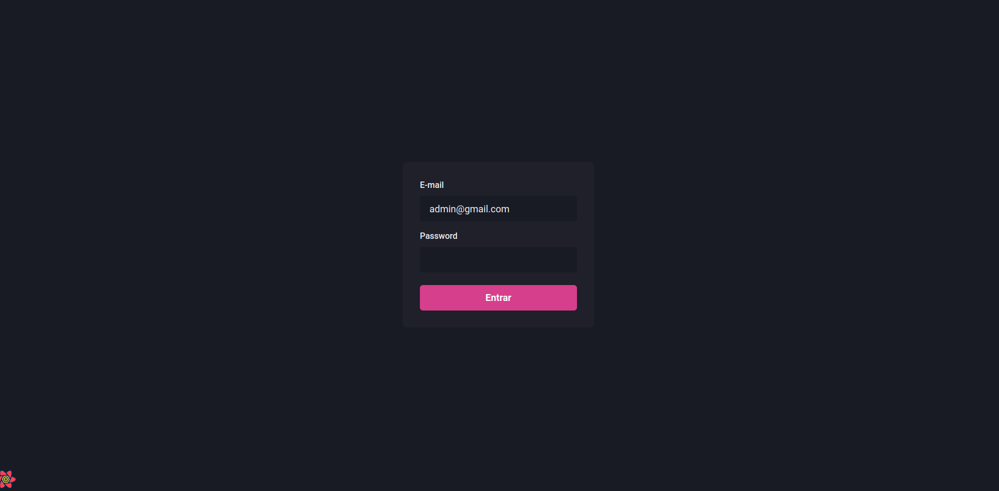
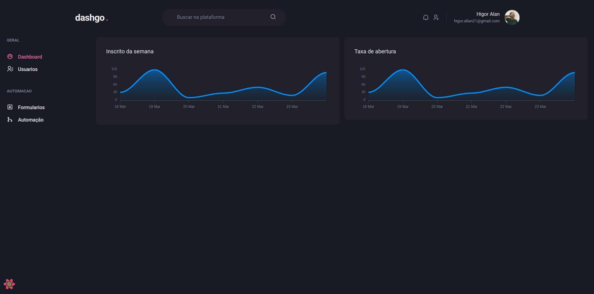
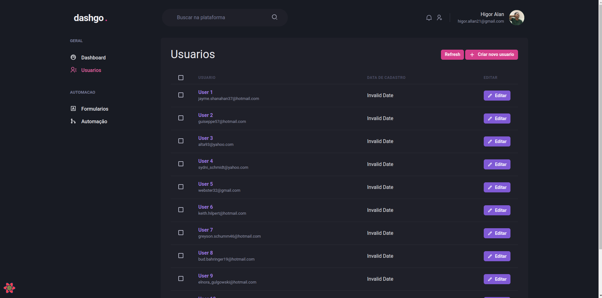
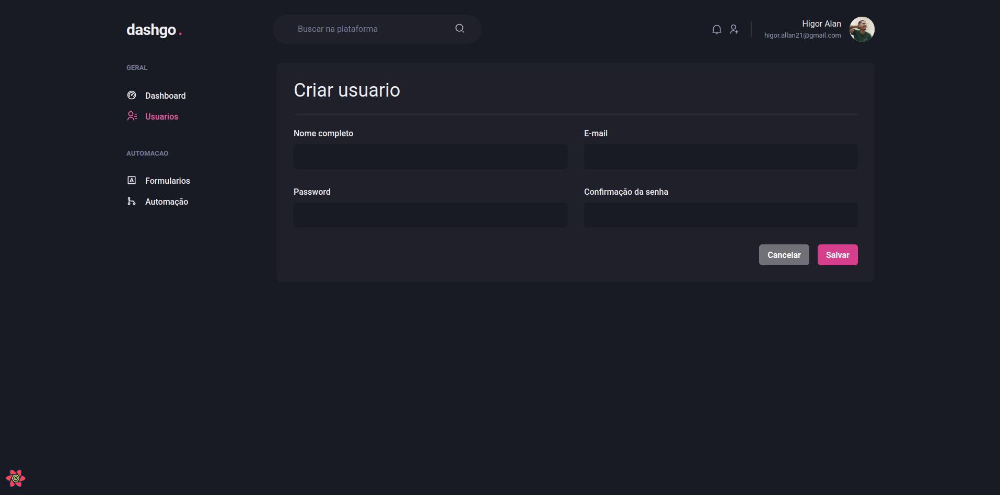

<div align="center" id="top">

&#xa0;

  <!-- <a href="https://myapp.netlify.app">Demo</a> -->
</div>

<h1 align="center">Dash go</h1>

<p align="center">
  <a href="#dart-about">About</a> &#xa0; | &#xa0; 
  <a href="#rocket-technologies">Technologies</a> &#xa0; | &#xa0;
  <a href="#white_check_mark-requirements">Requirements</a> &#xa0; | &#xa0;
  <a href="#checkered_flag-starting">Starting</a> &#xa0; | &#xa0;
  <a href="https://github.com/higoraln" target="_blank">Author</a> &#xa0; | &#xa0;
  <a href="#photos" target="_blank">Some Photos</a>

</p>

<br>

<h2 id="dart-about">About</h2>

This project was done together with the rocketseat team, with professor @diegofernandes, the project is a dashboard for user control, feature automation, and user coverage with graphics visualization.

<h2 id="rocket-technologies">Technologies</h2>

The following tools were used in this project:

- [Chakra-ui](https://chakra-ui.com/)
- [Next.js](https://nextjs.org/)
- [React](https://pt-br.reactjs.org/)
- [Apexcharts](https://apexcharts.com/)
- [React Icons](https://react-icons.github.io/react-icons/)
- [React Query](https://tanstack.com/query/v4/docs/adapters/react-query)
- [Yup](https://www.npmjs.com/package/yup)
- [React Hook Form](https://react-hook-form.com/)

<h2 id="white_check_mark-requirements">Requirements</h2>

First of all you will need [Git](https://git-scm.com) and [Node](https://nodejs.org/en/) installed.

<h2 id="checkered_flag-starting">Starting</h2>

```bash
# Clone this project
$ git clone https://github.com/higoraln/dashgo

# Access
$ cd dashgo

# Install dependencies
$ yarn

# Run the project
$ yarn dev

# Or
$ yarn build && yarn start

# The server will initialize in the <http://localhost:3000>
```

Made with ❤️ by <a href="https://github.com/higoraln}" target="_blank">Higor Allan</a>

&#xa0;

<h2>Some pictures</h2>






&#xa0;

<a href="#top">Back to top</a>
